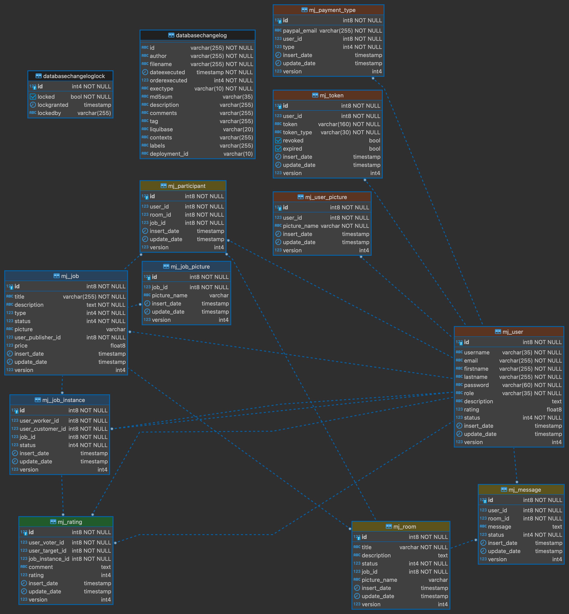
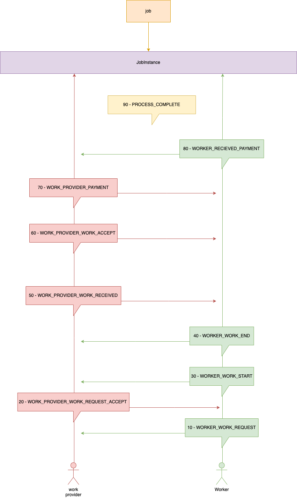

# MicroJobs

Micro Jobs is a small platform that allows users to offer or to request services in return for money. Look [here](https://github.com/goto-eof/micro-jobs-client) for the front-end project.

# Technologies
- Java 8+;
- Spring Boot (... +Spring Security);
- ModelMapper;
- Hibernate;
- Spring JPA;
- Liquibase;
- PostgreSQL;
- Mockito + JUnit
- Gradle;
- Docker;
- Git.

# Features
- user login (JWT);
- user logout;
- user registration;
- refresh token;
- view requests/offers;
- insert requests/offers;
- paginated requests/offers;
- picture upload;
- admin: approve post;
- message module: write/read DM between users;
- infinite scrolling in DM;
- microjob status;
- user rating;
- code testing with Mockito;
- ...wip.

# Architecture


# Job Instance status flow


# Run it
### Download and run docker database image
```
sudo docker-compose up -d
java -jar build/libs/micro-jobs-server-1.0-SNAPSHOT.jar
```
### Run as spring boot project from your IDE (IntelliJ)
The server will be reachable on port 8080

# Default username and password
```
username: admin
password: Micr@J@bs
```

If you want to get some information, feel free to [contact me](http://andre-i.eu/#contactme).
